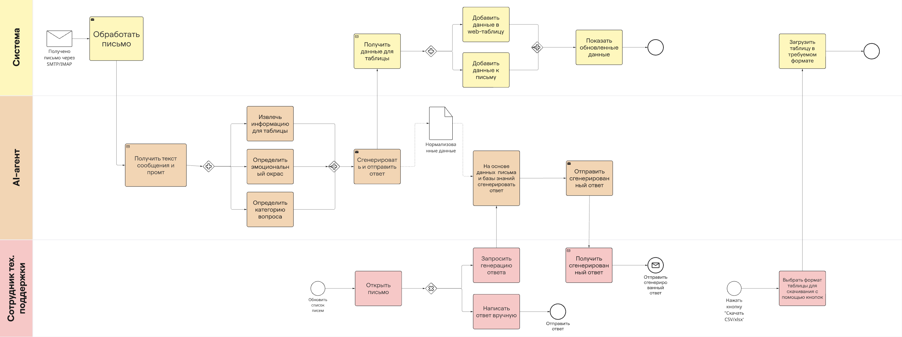
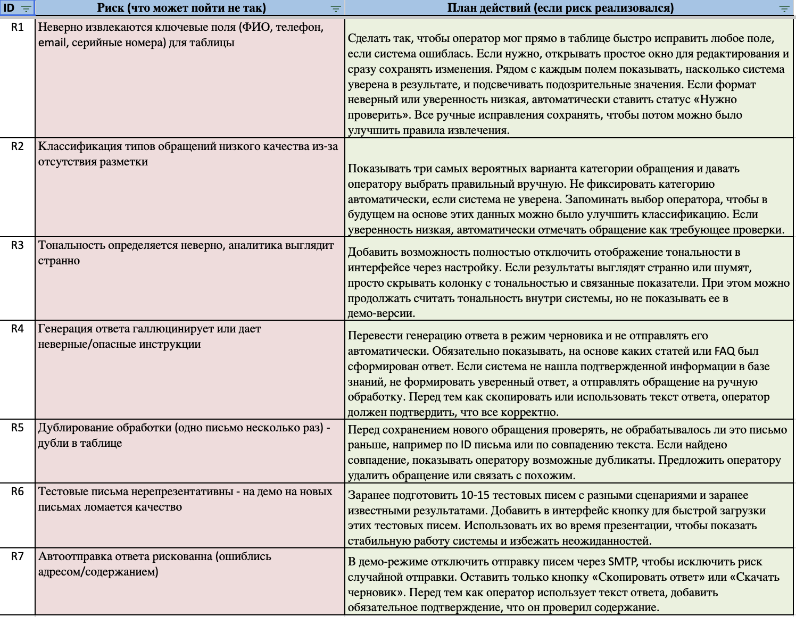

# Архитектура приложения

Архитектура приложения состоит из нескольких слоев:

1. **Backend** — отвечает за регулярную вычитку данных из почты с помощью cron job, обработку писем с помощью NLP-модели, запись обработанных данных в БД PostgreSQL. Подробная схема представлена ниже.

   Для взаимодействия с клиентской частью реализовано N endpoints:
   - TODO @ksim ручка — краткое описание
   - ...
   
   

2. **Frontend** — реализует необходимые пользовательские сценарии, описанные в ТЗ, среди них:
   - Отображение web-таблицы с требуемыми столбцами и обработанными через NLP-модель письмами
   - Возможность скачать таблицу в CSV/XLSX формате
   - Просмотр деталей каждого сообщения и генерация ответа с помощью модели на основе базы знаний

   Подробное описание каждого пути представлено в следующем разделе.
   
   

3. **База данных PostgreSQL**  
   TODO @ksim

---

# Пользовательский путь

Для визуализации пользовательского пути и описания взаимодействия с системой была выбрана методология CJM. Подробная схема представлена ниже. Для большей наглядности можно ознакомиться на [Miro](https://miro.com/app/board/uXjVJkKFdAQ=/?share_link_id=554951974234).

---

# Риски

В ходе работы также были проанализированы риски реализации проекта в условиях ограниченного времени. Также по ссылке в [таблице](https://docs.google.com/spreadsheets/d/1YOlNR1E7NO29H8ZWRdX9jl709Ire4Udtu-lRw437Ls4/edit?gid=1008867220#gid=1008867220).

---

# Состав команды

- **Степан** — frontend-разработчик. Разрабатывает на JavaScript/TypeScript, проходил стажировку в роли Angular-разработчика в компании “Т-Банк”. В университете принимал участие в разработке внутренней системы компании “UDV Group”.

- **Артемий** — ML-инженер. Для университетского проекта разрабатывал систему нормализации текстовых данных с использованием LLM на базе Llama. Победитель хакатона “Т1.Код.Март” 2025 в составе команды.

- **Максим** — ML-инженер. Имеет несколько лет опыта разработки на Python. Проходил стажировку в компании “Т-Банк” в роли ML-разработчика.

- **Егор** — backend-разработчик. Проходил стажировку в роли C++ разработчика в компании “Targem Games”. В университете принимал участие в разработке внутренней системы компании “UDV Group”.

- **Настя** — дизайнер продукта. Создает интерфейсы в Figma и продумывает пользовательский опыт. Проходила стажировку в компании “66 Бит”. Победитель хакатона “Т1.Код.Март” 2025 в составе команды.